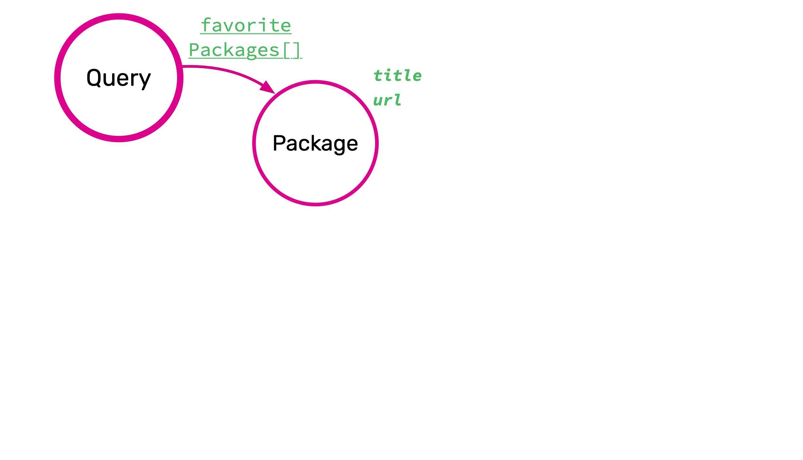
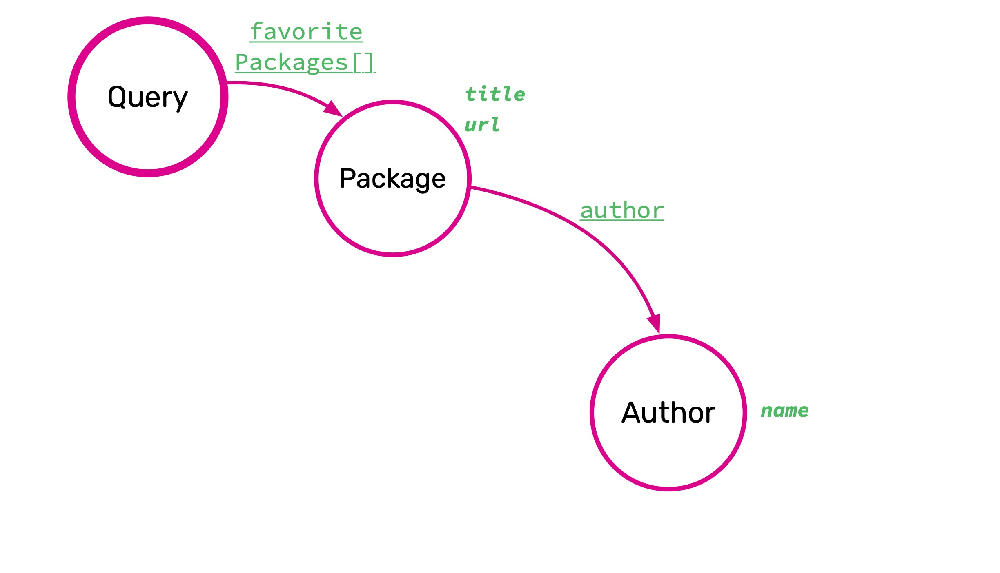
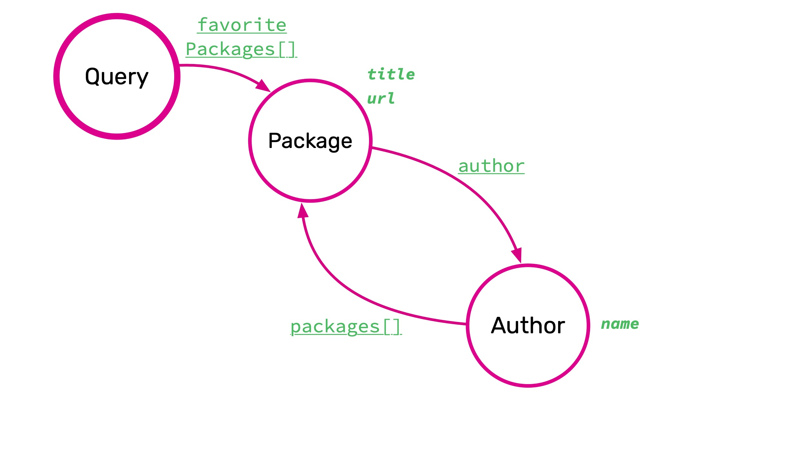
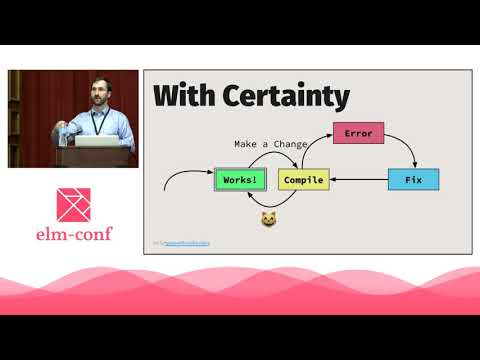
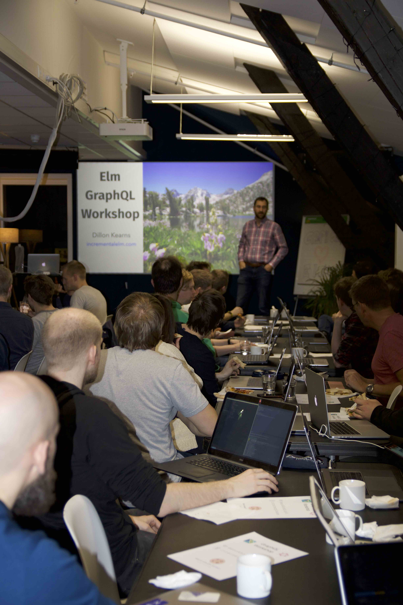
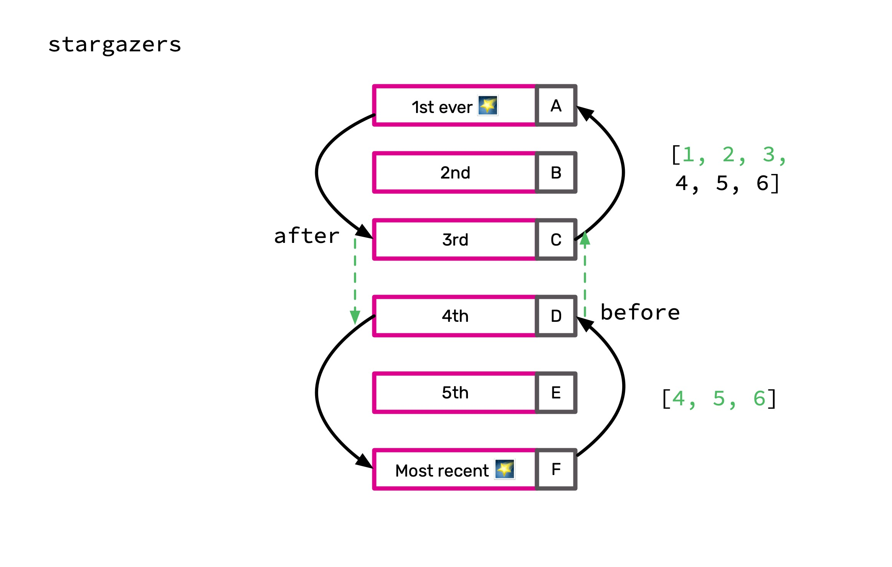

footer: incrementalelm.com
build-lists: true
slide-dividers: #

#

[.hide-footer]


# Setup

github.com/IncrementalElm/elm-graphql-workshop

# Defining Success

- Introduce yourself
- GraphQL experience? Elm experience?
- Share what wild success would look like for you
- What would the visible outcome look like?

# GraphQL Intro

- Created by Facebook
- [Who's using it?](https://graphql.org/users/)
- Perfect fit for Elm
- Under-fetching & over-fetching
- The REST dance
- Graphiql
- Introspection
- Documentation navigation

# Challenges

- Caching
  - GET versus POST
  - Flexible payloads
  - Servers are catching up to new practices
- N+1 queries
  - Solves the problem in some ways, makes it harder in others

# GraphQL Concepts

- SDL (Schema Definition Language)

# Query

```haskell
type Query {
  helloIsAnyoneHome: String
}
```

^ - Introduce GraphQL Playground

^ - Sometimes null

# `GraphQL Field`

Data that you ask for in your query.

# Fields

```haskell
type Query {
  helloIsAnyoneHome: String
}
```

```haskell
query {
  helloIsAnyoneHome
}
```

```javascript
{
  "data": {
    "helloIsAnyoneHome": "One sec, I'll be right there!"
  }
}
```

^ #### Schema Definition Language (`SDL`)

^ #### GraphQL Query (`gql`)

^ #### Response (`JSON`)

# Nullability

```haskell
type Query {
  helloIsAnyoneHome: String
  hello: String!
}
```

^ - What does GraphQL buy you?

^ - Single end point

^ - Free docs

^ - Built-in vs. ad-hoc type checking.

# Scalars Are Leaves

- String
- Int
- Float
- Boolean
- ID
- Custom Scalars (URL, GitSha, Miles)
- Enum

^ - More on custom scalars later.

# Enums

```haskell
enum Order {
  ASCENDING
  DESCENDING
}
```

# Objects

[.code-highlight: all]

[.code-highlight: 2]

```haskell
type Package {
  title: String!
  url: String!
  versions: [String!]!
}
```

# -



# -


[.code-highlight: all]

[.code-highlight: 3]

[.code-highlight: 2-4]

<br>
<br>
<br>

``````haskell
query {
  favoritePackages {
    title
  }
}
```

#### [`run`](http://localhost:4000/?query=query%20%7B%0A%20%20favoritePackages%20%7B%0A%20%20%20%20title%0A%20%20%7D%0A%7D%0A)


^ - Unlike REST, explicitly get all fields

^ - Not a Leaf

^ - Still a field

^ - Selection Sets

# Branches Versus Leaves

`````haskell
query {
  favoritePackages {
    title
  }
}
```

^ - Must explicitly state selection for branches.

^ - Scalar fields are leaves.


# -



<br>
<br>
<br>

````haskell
query {
  favoritePackages {
    title
  }
}
```

#### [`run`](http://localhost:4000/?query=query%20%7B%0A%20%20favoritePackages%20%7B%0A%20%20%20%20title%0A%20%20%7D%0A%7D%0A)

^ - Data shape matches request
# -


[.code-highlight: 4]

<br>
<br>
<br>

````haskell
query {
  favoritePackages {
    title
    author { name }
  }
}
```

#### [`run`](http://localhost:4000/?query=query%20%7B%0A%20%20favoritePackages%20%7B%0A%20%20%20%20title%0A%20%20%7D%0A%7D%0A)

^ - Data shape matches request

# -



# Everything Is A Field

```haskell
type Query {
  helloIsAnyoneHome: String
  hello: String!
  favoritePackages: [Package!]!
}
```

```haskell
query {
  helloIsAnyoneHome
}
```

^ - If you ask for it, it's a field.

^ - Including query.


# Mutations

```haskell
mutation {
  addTodo(description: "Learn GraphQL")
}
```

- Just Objects

- Pick one: `query`, `mutation`, `subscription`


# Graphiql Demo

# Exercise 00

```bash
cd /path/to/repo
npm install
./run.sh src/part00
```

^ - Introduce panes.


# `dillonkearns/elm-graphql`

# Avoidable Uncertainty


# With Certainty


# Types Without Borders




# GraphQL Client Strategies

- No code generation
- Generate code for specific query
- Generate code for whole schema

# `elm-graphql` Features

- High-level DSL for GraphQL queries
- Elm language constructs to build and abstract (not Strings)
- JSON response under the hood
- Meaningful Elm data structures above the hood
- Elm compiler errors for invalid queries
- Docs in your editor

# `elm-graphql` CLI

- Introspection queries
- Just point it at your schema!
- Check in generated code
- Nice to organize in `gen` folder

# Take the SPC
- Shortest Path to Compile


# Shortest Path to Compile

- "Clean code, that works."
  - Clean -> Work
  - Work -> Clean
- "Clean code, that works, and compiles!"
  - Compile -> Work -> Clean


# Exercise 01 - Our First Query

Walk Before You Run

```
./run.sh src/part01
```

# Exercise 02 - Nested Selection Sets

```bash
./run.sh src/part02
```


# Exercise 03 - Transforming Selection Sets

```bash
./run.sh src/part03
```

# Programming by Intention

```elm
Fibonacci.init
  |> Fibonacci.next
  |> Fibonacci.next
  |> Fibonacci.next
  |> Expect.equal 2
```

- `Fibonacci.of(2) |> Expect.equal 2`

- Consider use before implementation

# Annotations

- Annotation-driven code

- Code-driven annotation

- Both are useful tools ([tweet](https://twitter.com/joelquen/status/1100158323641499648))


# Exercise 04 - Combining

```bash
./run.sh src/part04
```

# Exercise 05 - Deconstructing Constructors

```bash
./run.sh src/part05
```

# Exercise 06 - Pipelines

```bash
./run.sh src/part06
```

# Required Arguments

```haskell
type Query {
  repository(owner: String!, name: String!): Repository
}
```

```haskell
query {
  repository {
    name
  }
}
```

#### [run](https://developer.github.com/v4/explorer/?query=query%20%7B%0A%20%20repository%20%7B%0A%20%20%20%20name%0A%20%20%7D%0A%7D)

^ - What's going to happen?

^ - By the way, way is Repository nullable?

# GraphQL Arguments

```haskell
type User {
  avatarUrl(size: Int): URI!
}
```

```haskell
query {
  viewer {
    avatarUrl
  }
}
```

#### [run](https://developer.github.com/v4/explorer/?query=query%20%7B%0A%20%20viewer%20%7B%0A%20%20%20%20avatarUrl%0A%20%20%7D%0A%7D)

^ - What's going to happen?

# GraphQL Arguments

```haskell
type User {
  avatarUrl(size: Int): URI!
}
```

```haskell
query {
  viewer {
    avatarUrl(size: 48)
  }
}
```


#### [run](https://developer.github.com/v4/explorer/?query=query%20%7B%0A%20%20viewer%20%7B%0A%20%20%20%20avatarUrl(size%3A%2048\)%0A%20%20%7D%0A%7D)

# Non-Scalar Arguments

- How do you abstract a set of arguments?

# Top-Level Arguments
```haskell
type Repository {
  issues(assignee: String, createdBy: String, labels: [String!], ...)
}

type User {
  issues(assignee: String, createdBy: String, labels: [String!], ...)
}
```

# Required Argument Code Gen

```elm
currentWeather : CurrentWeatherRequiredArguments
    -> SelectionSet decodesTo Weather.Object.CurrentWeather
    -> SelectionSet decodesTo RootQuery

type alias CurrentWeatherRequiredArguments = { someArgument : String, ... }
```

# Cunningham's Law

- "The best way to get the right answer on the Internet is not to ask a question, it's to post the wrong answer."

# Exercise 07 - Required Arguments

```bash
./run.sh src/part07
```

# Optional Argument Code Gen

```elm
currentWeather : (CurrentWeatherOptionalArguments -> CurrentWeatherOptionalArguments)
    -> CurrentWeatherRequiredArguments
    -> SelectionSet decodesTo Weather.Object.CurrentWeather
    -> SelectionSet decodesTo RootQuery

type alias CurrentWeatherRequiredArguments = { someArgument : String, ... }
```

- Helps to memorize this order
- Always the same
- Any argument may be missing
- How do you give no optional arguments?

# `identity`

- `a -> a`
- How would you define this function?
- Get it compiling, then get it right

# The `OptionalArgument` type

```elm
type OptionalArgument a
    = Present a
    | Absent
    | Null
```

- Why not just a Maybe?
- [`OptionalArgument` docs](https://package.elm-lang.org/packages/dillonkearns/elm-graphql/latest/Graphql-OptionalArgument)

# Supplying Optional Args

```elm
-- Null, Present, Absent
import Graphql.OptionalArgument exposing (OptionalArgument(..))

Query.hero (\optionals -> {optionals | episode = Present Episode.EMPIRE })
```

- Which is the default if you don't pass it in?
- [Optional Args in a Language Without Optional Args](https://medium.com/@zenitram.oiram/graphqelm-optional-arguments-in-a-language-without-optional-arguments-d8074ca3cf74)

# Exercise 08 - Optional Arguments

```bash
./run.sh src/part08
```

# Input Objects
```haskell
input IssueFilters {
  assignee: String
  createdBy: String
  labels: [String!]
  # ...
}

type Repository {
  issues(IssueFilters)
}

type User {
  issues(assignee: String, createdBy: String, labels: [String!], ...)
}
```

- Definition: a group of scalars
- Exactly like a GraphQL Object
- Except that it can't be recursive
- Allows you to state that a group must either be there or not
- Still can't express union types fully (like one of (first,last))

# Feedback

- Anonymous Survey
  - [incrementalelm.com/feedback](https://incrementalelm.com/feedback)

# Advanced Workshop 3/21, 1-5pm PST

- Handling imperfect schemas
- Improving schemas
- Data modeling
- Polymorphic types
- Custom Scalars
- Custom Scalar Codecs
- Pagination
- New pagination API


# Elm Europe Workshop!

June 26 in Paris




# -



# -


# -
``````
